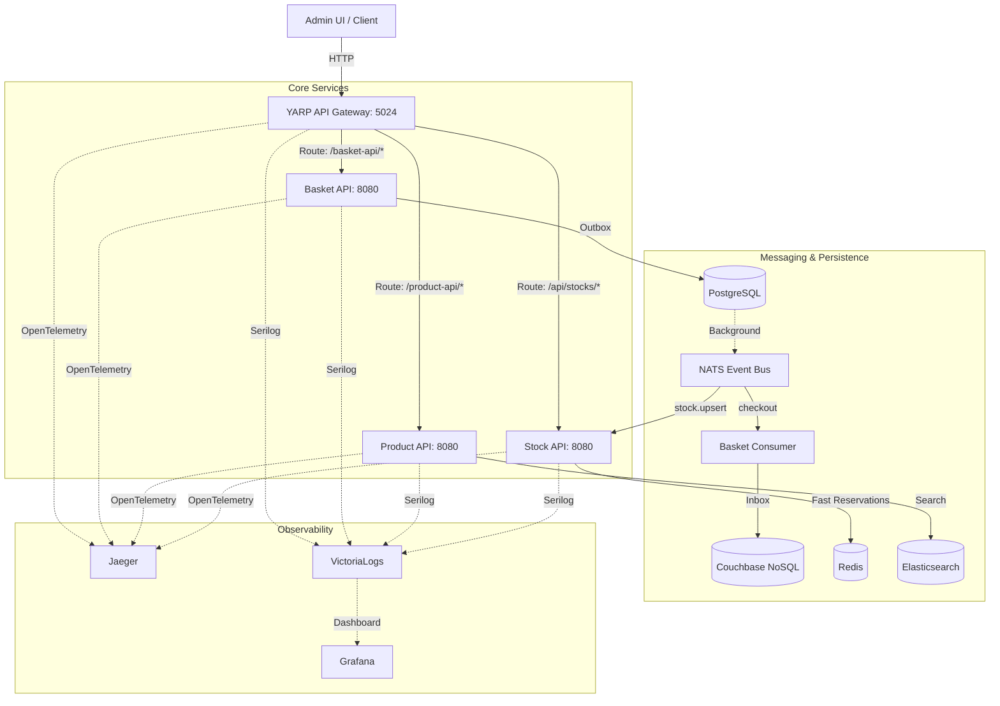

# Lothal: Distributed Microservices Ecosystem

[](https://dotnet.microsoft.com/download)
[](https://vuejs.org/)
[](https://www.docker.com/)

**Lothal** is a high-performance, resilient microservices ecosystem built for scale and visibility. It demonstrates modern distributed system patterns like **CQRS**, **Event Sourced Ingestion**, **Outbox/Inbox Patterns**, and **Real-time Atomic Reservations**.

---

## 🏗 System Architecture

Lothal is designed with a **Gateway-First** approach, ensuring all external traffic is routed through a single, protected entry point.



---

## 🛠 Technology Dashboard

| Category | Technology | Purpose |
| :--- | :--- | :--- |
| **Framework** | **.NET 8** | High-performance Minimal APIs & Background Workers. |
| **Messaging** | **NATS** | Lightweight, ultra-fast async event bus. |
| **Relational DB** | **PostgreSQL** | Source of truth for baskets, stock levels, and outbox logs. |
| **NoSQL / Inbox** | **Couchbase** | Scalable storage for consumer events & idempotency. |
| **Cache / Atomic** | **Redis** | Atomic stock reservations using Lua scripts. |
| **Search Engine** | **Elasticsearch** | Fast, full-text product catalog search. |
| **Gateway** | **YARP** | Dynamic routing, load balancing, and rate limiting. |
| **Frontend** | **Vue 3 + Pinia** | Modern, reactive dashboard for inventory management. |
| **Observability** | **Grafana + Jaeger** | Centralized logs (Victoria) and distributed traces. |

---

## 🚀 Key Features

- **🌐 Resilient Gateway**: YARP-powered gateway with fixed-window **Rate Limiting** and automated **Load Balancing** across multiple API replicas.
- **⚡ Atomic Reservations**: Real-time stock reservation using **Redis Lua Scripts**, preventing race conditions even under extreme shopping loads.
- **🛡️ Data Integrity**: Implementation of the **Outbox Pattern** in the Basket API ensures that domain events are never lost, even if the messaging system is down.
- **🔁 Event-Driven Metadata**: Automatic synchronization between the Core Product feed and the Stock service via **NATS.Net**.
- **🔭 Deep Visibility**: End-to-end distributed tracing using **OpenTelemetry**. Every request is traceable from the Gateway down to the specific SQL/NoSQL command.
- **📦 Clean Architecture**: Strict separation of concerns using `Domain`, `Application`, `Infrastructure`, and `Api` layers.

---

## 🔭 Monitoring & Observability

Lothal comes pre-configured with a full observability stack. All logs are shipped as structured JSON.

| Tool | Access URL | Description |
| :--- | :--- | :--- |
| **Grafana** | [http://localhost:3000](http://localhost:3000) | Metrics & Logs visualization (Admin / admin). |
| **Jaeger** | [http://localhost:16686](http://localhost:16686) | Distributed traces analyzer. |
| **VictoriaLogs** | [http://localhost:9428](http://localhost:9428) | High-performance log query UI. |
| **NATS Monitor** | [http://localhost:8222](http://localhost:8222) | Messaging server internal dashboard. |

---

## 📥 Getting Started

### Prerequisites
- [Docker & Docker Compose](https://www.docker.com/products/docker-desktop)
- [.NET 8 SDK](https://dotnet.microsoft.com/download) (for local builds)
- [Node.js](https://nodejs.org/) (for Admin UI)

### 1. Spin up the Infrastructure
From the root directory:
```bash
docker-compose up -d --build
```
*Note: This automatically scales the APIs and waits for database health before starting.*

### 2. Run the Admin Dashboard
```bash
cd src/UI/lothal-admin-ui
npm install
npm run dev
```
Navigate to [http://localhost:5173/](http://localhost:5173/) to start managing your inventory.

---

## 📝 License
This project is open-source and intended for educational and demonstration purposes.
